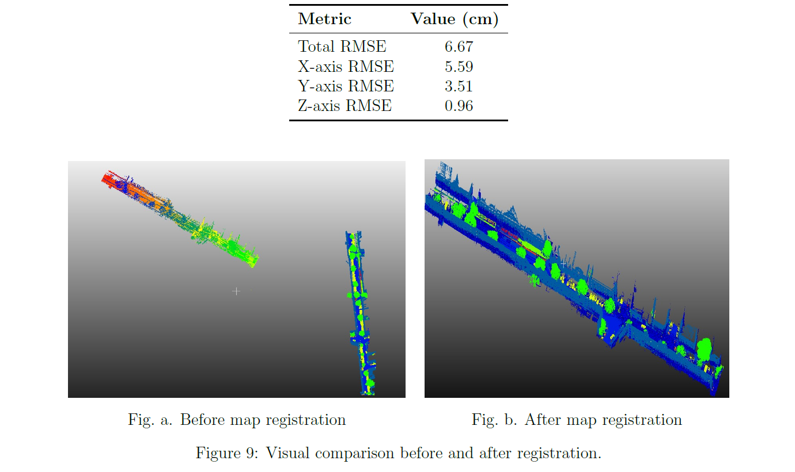

LiDAR Mapping, Localization and Change Detection using KISS-SLAM
Overview
This project investigates LiDAR-based mapping, localization, map registration, and environmental change detection using KISS-SLAM and point cloud processing techniques.

The work was conducted as part of the Project Seminar at Leibniz University Hannover and focuses on generating 3D maps from mobile LiDAR measurements, aligning newly acquired scans with reference maps, and identifying structural changes between different acquisition epochs.

Project Objectives
Generate large-scale 3D maps using KISS-SLAM
Perform localization through map registration
Align reference and query point clouds
Investigate ICP-based registration techniques
Detect changes between temporal point cloud datasets
Analyze registration accuracy and robustness
Methodology
LiDAR-based mapping using KISS-SLAM
Point cloud preprocessing
Registration using geometric alignment techniques
Localization within the reference map
Change detection through map comparison
Quantitative and qualitative evaluation
Technologies
Python
Open3D
NumPy
Point Cloud Processing
KISS-SLAM
ICP Registration
LiDAR Mapping
Change Detection
Repository Structure
docs/ : Project report and technical documentation
presentations/ : Seminar presentations
results/ : Registration and change detection results
code/ : Map registration and change detection implementations
Applications
Autonomous Driving
Robotics
SLAM
Geospatial Mapping
Digital Twins
Environmental Monitoring
Author

Muhammad Jawad

M.Sc. Geoinformatics

Leibniz University Hannover
